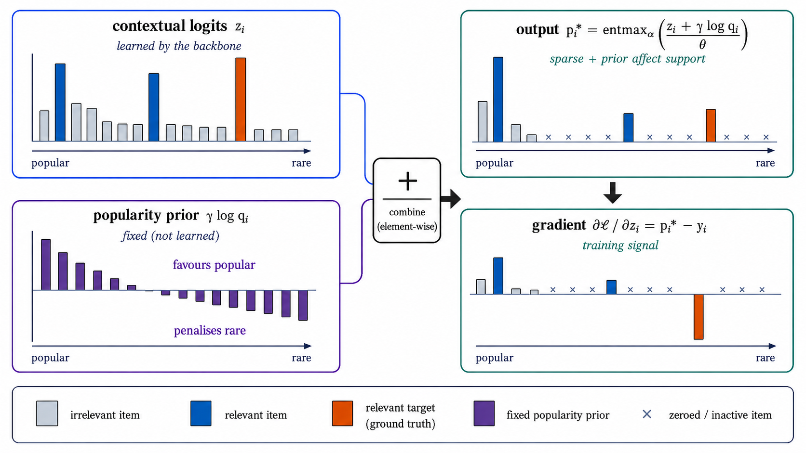
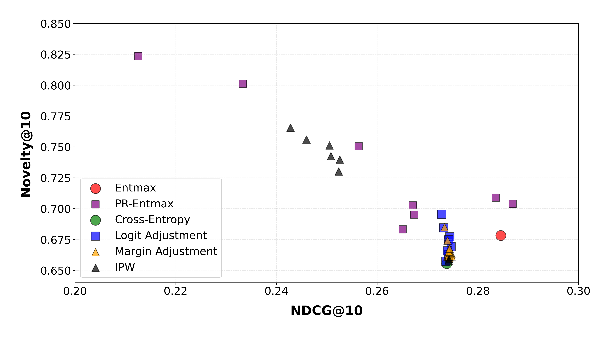
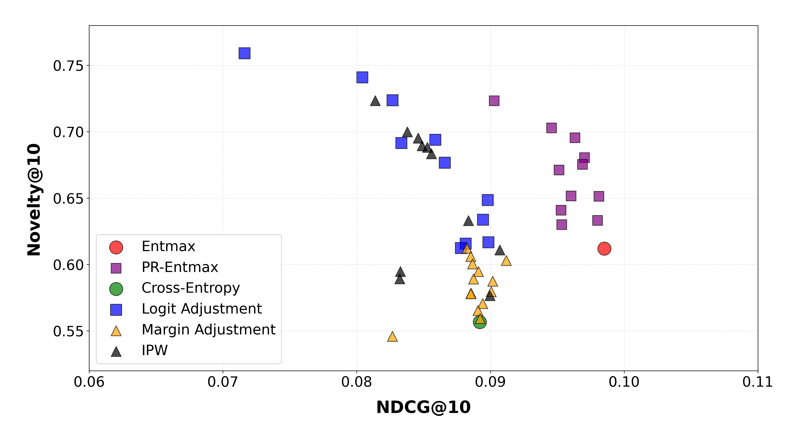
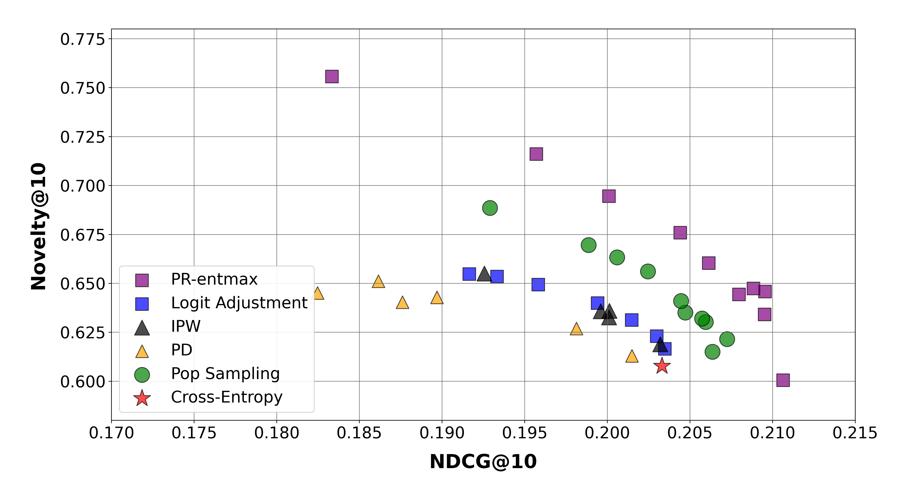
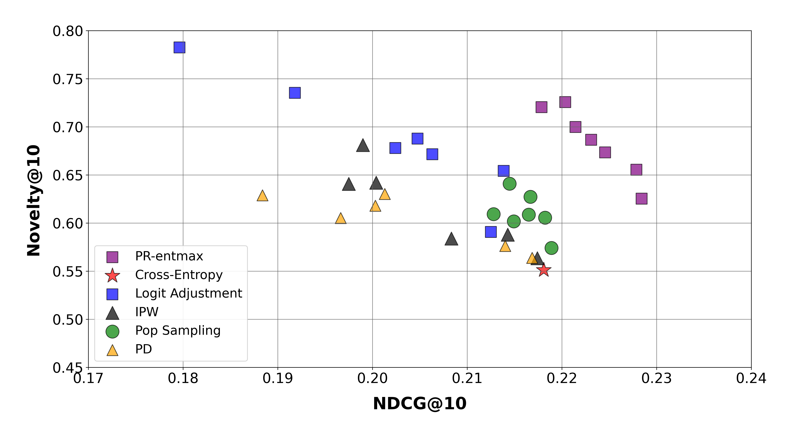

# Mitigating Popularity Bias in Sequential Recommendations with Sparse Prior-Regularized Objective


[Anton Pembek](https://scholar.google.com/citations?user=1oCtv4QAAAAJ) ·
[Anton Klenitskiy](https://scholar.google.com/citations?user=eGTslO8AAAAJ) ·
Alexander Savchenko ·
[Alexey Vasilev](https://scholar.google.com/citations?user=4vb0JIwAAAAJ)

---

> Popularity bias is a well-known challenge in recommender systems, often leading to the over-exposure of popular items and reduced catalog coverage. In this work, we propose PR-entmax, a sparse prior-regularized objective that makes popularity correction context-dependent. We derive our method from a generalized variational principle in which an item popularity prior is incorporated directly into a sparse probability mapping, yielding a popularity-aware active support: the set of items receiving non-zero probabilities and hence non-zero gradients is determined jointly by contextual relevance and item popularity. As a result, the prior affects not only item probabilities, but also which items participate in gradient updates during training. The method requires no architectural changes and can be integrated into existing training pipelines by modifying only the loss function. At inference time, the prior term is removed, and items are ranked by the learned contextual relevance alone. Experiments across multiple benchmark datasets and sequential recommendation architectures show that PR-entmax consistently reduces popularity bias while preserving or improving recommendation relevance, advancing the relevance-debiasing trade-off.

## Method

PR-entmax introduces a **popularity-aware sparse training objective**.  
For each item \(i\), the backbone produces a contextual relevance score, which is combined with a fixed popularity prior:

```math
s_i^{\mathrm{train}}(x) = z_i(x) + \gamma \log q_i
```

where:

- `z_i(x)` — contextual logit produced by the sequential recommendation model;
- `q_i` — item popularity prior estimated from the training data;
- `γ` — strength of the popularity prior;
- `θ` — temperature parameter;
- `α` — entmax sparsity parameter;
- `τ` — threshold defining the active support.

The adjusted scores are transformed using a sparse entmax mapping:

```math
p^*(z)
=
\mathrm{entmax}_{\alpha}
\left(
\frac{z + \gamma \log q}{\theta}
\right)
```

Unlike softmax, entmax assigns exactly zero probability to part of the catalog.  
The resulting active support is therefore popularity-aware:

```math
\mathrm{supp}(p^*)
=
\left\{
i : z_i + \gamma \log q_i > \theta \tau
\right\}
```

Only items inside this support receive non-zero probabilities and gradients during training. Thus, the popularity prior affects not only the probability values, but also **which items participate in optimization**.

<p align="center">
  
</p>

<p align="center">
  <em>
    Illustration of the PR-entmax training pipeline. Contextual logits produced by the backbone are combined with a fixed item popularity prior. The adjusted scores are passed through entmax, producing a sparse, popularity-aware distribution whose active support determines which items receive non-zero gradients.
  </em>
</p>

At inference time, the popularity prior is removed and items are ranked using only the learned contextual relevance:

```math
s_i^{\mathrm{inference}}(x) = z_i(x)
```
___

## Results
Below we present the trade-off between NDCG@10 and Novelty@10 across different loss functions and hyperparameter configurations for all datasets.

**Figure 1:** Trade-off between NDCG@10 and Novelty@10 for **Tmall** dataset.  


**Figure 2:** Trade-off between NDCG@10 and Novelty@10 for **Yambda-50M** dataset.  


**Figure 3:** Trade-off between NDCG@10 and Novelty@10 for **Yoochoose** dataset.  


**Figure 4:** Trade-off between NDCG@10 and Novelty@10 for **Zvuk** dataset.  


## Usage
Install requirements:
```sh
pip install -r requirements.txt
```
Specify environment variables:
```sh
# path to the project
export PATH4SEQ="/your/path"
# path to the split data
export RECSYS_DATA_PATH="/your/path"
```
Example of run via command line:
```sh
cd runs
# PR-Entmax on Tmall dataset
python dl.py datasets_info=Tmall dataset_params.num_negatives=50000 model_params.num_blocks=2 model_params.num_heads=4 model_params.dropout_rate=0.1 model_params.hidden_units=256 type_loss=entmax temp=1.71 gamma=0.05 seqrec_module.type_correction=logit

# Entmax on Tmall dataset
python dl.py datasets_info=Tmall dataset_params.num_negatives=50000 model_params.num_blocks=2 model_params.num_heads=4 model_params.dropout_rate=0.1 model_params.hidden_units=256 type_loss=entmax temp=1.71

# Logit Adjustment on Tmall dataset
python dl.py datasets_info=Tmall dataset_params.num_negatives=50000 model_params.num_blocks=3 model_params.num_heads=4 model_params.dropout_rate=0.1 model_params.hidden_units=256 type_loss=ce temp=1 seqrec_module.type_correction=logit gamma=0.4

# IPW on Tmall dataset
python dl.py datasets_info=Tmall dataset_params.num_negatives=50000 model_params.num_blocks=3 model_params.num_heads=4 model_params.dropout_rate=0.1 model_params.hidden_units=256 type_loss=ce temp=1 seqrec_module.type_correction=ipw gamma=0.75

# Pop Sampling on Tmall dataset
python dl.py datasets_info=Tmall dataset_params.num_negatives=50000 model_params.num_blocks=3 model_params.num_heads=4 model_params.dropout_rate=0.1 model_params.hidden_units=256 type_loss=ce temp=1 dataset_params.gamma=0.9

# PD on Tmall dataset
python dl.py datasets_info=Tmall dataset_params.num_negatives=50000 model_params.num_blocks=3 model_params.num_heads=4 model_params.dropout_rate=0.1 model_params.hidden_units=256 type_loss=ce temp=1 seqrec_module.type_correction=pd gamma=0.15

# Cross-Entropy on Tmall dataset
python dl.py datasets_info=Tmall dataset_params.num_negatives=50000 model_params.num_blocks=3 model_params.num_heads=4 model_params.dropout_rate=0.1 model_params.hidden_units=256 type_loss=ce temp=1

#Parameter tuning for Tmall with ce loss
python optuna_rec.py datasets_info=Tmall type_loss=ce --multirun

#Parameter tuning for Tmall with entmax loss
python optuna_rec.py datasets_info=Tmall type_loss=entmax --multirun

```
